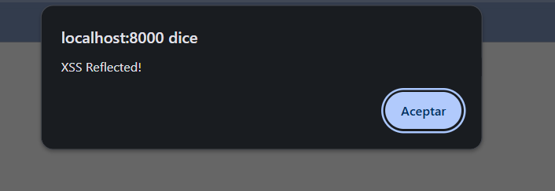
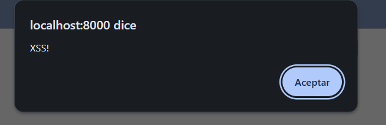
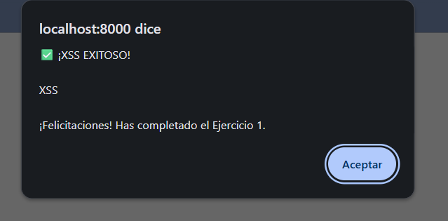
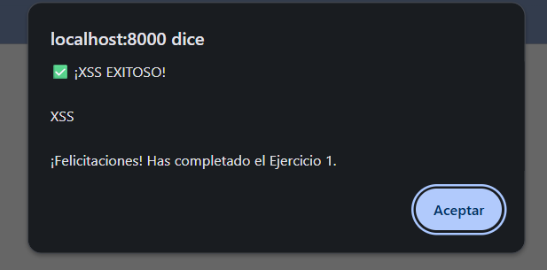
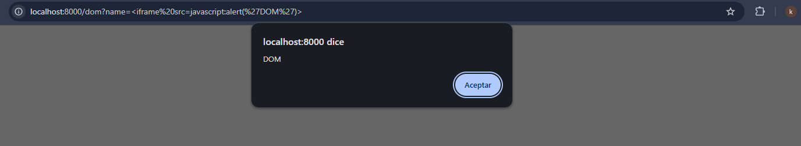
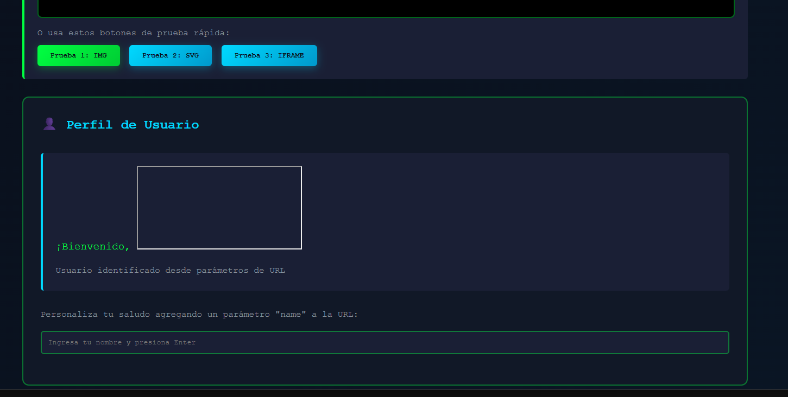

## Keiner Astos - Ian Cardona
### desarrrollo de actividades
### EJERCICIO 1: flected XSS
## NUM. 1
```bash
<script>alert('XSS Reflected!')</script>
```
### RESULTADO

```
Al ejecutar este script dentro del campo de entrada, se observa que aparece una alerta en la parte superior con el mensaje especificado. Esto indica que el input es vulnerable, ya que permite la ejecución de código JavaScript sin validación.
```
## NUM. 2

```bash

```
### RESULTADO

```
En esta prueba, la etiqueta  con un atributo onerror provoca la ejecución de una alerta con el texto "XSS!". Esto ocurre porque la imagen no se carga y se dispara el evento onerror.
```
## NUM. 3
```bash
<svg onload=alert('XSS')>
```
### RESULTADO

```
El elemento "<svg>" permite ejecutar JavaScript mediante el evento onload. La alerta "XSS" confirma nuevamente la vulnerabilidad del input.
```
## NUM. 4
```bash
<body onload=alert('XSS')>
```
### RESULTADO

```
La carga del elemento <body> con el evento onload genera la alerta "XSS". Esto demuestra que el sistema interpreta directamente el contenido inyectado sin filtros de seguridad.
```
### EJERCICIO 2: Stored XSS
## NUM. 1
```bash
<script>alert('Stored XSS!')</script>
```
### RESULTADO:

```
El script queda almacenado y se ejecuta cada vez que se carga la página, lo que confirma la vulnerabilidad de tipo Stored XSS.
```
## NUM. 2
```bash

```
### RESULTADO:
```
Al almacenar este payload con una etiqueta  que contiene un evento onerror, la alerta “Stored SS!” se ejecuta automáticamente cada vez que la página carga el comentario o registro almacenado. Esto demuestra que el sistema guarda y reproduce el código malicioso sin sanitizarlo.
```
## NUM. 3
```bash
<svg onload=alert('Persistent XSS')>
```
### RESULTADO:
```
El elemento <svg> con el evento onload se ejecuta automáticamente al cargarse la página donde quedó almacenado el payload. Esto provoca la alerta “Persistent XSS”, evidenciando que la aplicación reproduce contenido malicioso desde la base de datos.
```
## NUM. 4
```bash
<iframe src="javascript:alert('XSS')">
```
### RESULTADO:
```
El iframe con esquema javascript: se ejecuta al momento de cargar el contenido almacenado, generando una alerta con el mensaje “XSS”. Esto demuestra que el sistema permite la inserción de iframes maliciosos sin validación.
```
## NUM. 5
```bash
<input onfocus=alert('XSS') autofocus>
```
### RESULTADO:
```
El campo <input> almacenado con el atributo onfocus dispara la alerta “XSS” cada vez que el usuario hace clic sobre el elemento. Esto confirma que el evento queda persistente y se ejecuta cuando el navegador lo interpreta.
### EJERCICIO 3: DOM-based XSS
```
## NUM. 1

```bash
?name=<iframe src=javascript:alert('DOM')>
```
```
La manipulación del parámetro name en la URL causa la ejecución del código JavaScript directamente en el DOM, demostrando una vulnerabilidad basada en DOM.
```


## NUM. 2 
```
Al hacer clic en “Prueba 3”, se puede observar que se inserta un iframe dentro del div correspondiente a la sección de perfil de usuario.
```
 